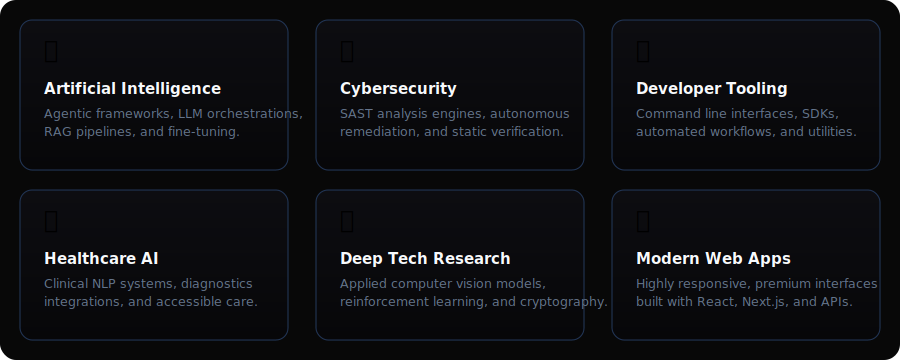
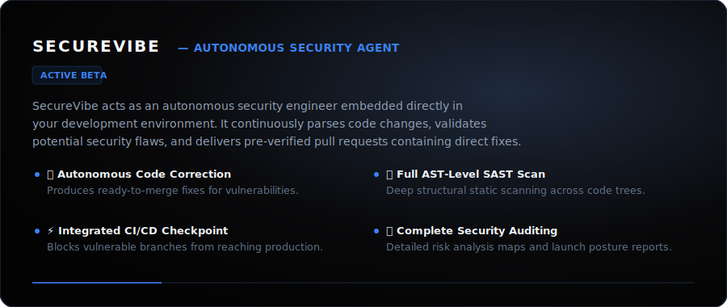
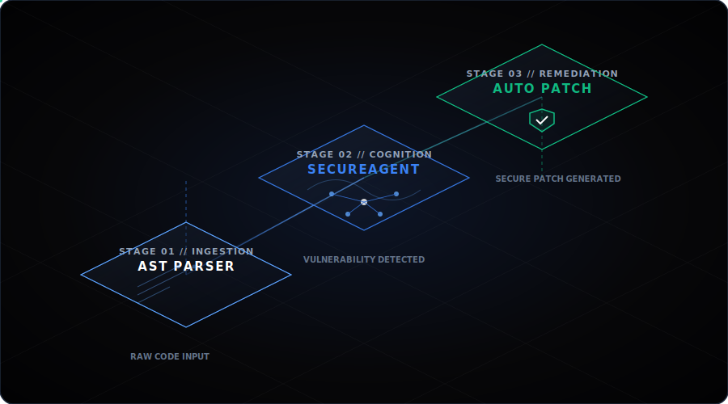
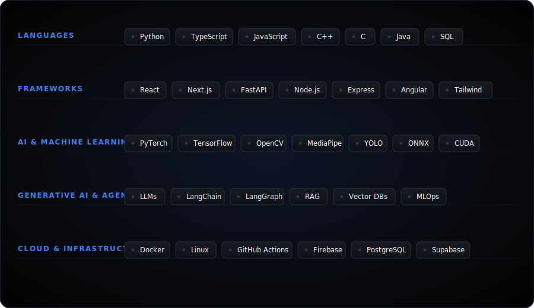

<!-- ============================================================
     BENEDICT PATRICK — Premium GitHub Profile README
     Designed & Engineered with absolute precision
     ============================================================ -->

<div align="center">

<!-- HERO BANNER -->


<br/><br/>

<!-- DYNAMIC TYPING STATUS -->
<a href="https://git.io/typing-svg" target="_blank">
  
</a>

</div>

<br/>

<!-- SECTION DIVIDER -->
<div align="center">
  
</div>

<br/>

<!-- ABOUT ME SECTION -->
<table width="100%" border="0" cellspacing="0" cellpadding="0">
<tr>
<td width="55%" valign="top">

## 🧠 About Me

I am **Benedict Patrick**, an AI Engineer, Cybersecurity Researcher, and Startup Founder building the next generation of intelligent, secure systems.

My engineering focus lies at the intersection of **Deep Learning**, **Agentic AI**, and **Autonomous Security**. I specialize in turning deep tech research papers into scalable production software, emphasizing clean architecture, modular system design, and exceptional developer experience.

Whether optimizing neural networks, writing static analysis parsers, or designing distributed systems, I aim for high-integrity craftsmanship.

</td>
<td width="5%"></td>
<td width="40%" valign="top">

```yaml
# Executive Profile
identity:
  name: Benedict Patrick
  focus: AI, Deep Learning, Security
  venture: SecureVibe
  status: Always Building

collaboration:
  research: active
  startups: active
  open_source: active
```

</td>
</tr>
</table>

<br/>

<!-- SECTION DIVIDER -->
<div align="center">
  
</div>

<br/>

<!-- WHAT I BUILD (BENTO GRID - HIGH FIDELITY SVG) -->
<div align="center">
  <h2>🛠️ Core Spheres of Engineering</h2>
  <p>Systems built with clean architecture, high scalability, and clean code.</p>
  <br/>
  
</div>

<br/>

<!-- SECTION DIVIDER -->
<div align="center">
  
</div>

<br/>

<!-- STARTUP (SECUREVIBE - HIGH FIDELITY SVG) -->
<div align="center">
  <h2>🚀 Featured Venture</h2>
  <p>Transforming software security through autonomy.</p>
  <br/>
  
  <br/><br/>
  <p>Install the CLI agent globally:</p>
  <pre><code>npm install -g securevibe</code></pre>
</div>

<br/>

<!-- SECTION DIVIDER -->
<div align="center">
  
</div>

<br/>

<!-- SECUREVIBE PIPELINE VISUALIZATION -->
<div align="center">
  <h2>🤖 Autonomous Compilation &amp; Security Pipeline</h2>
  <p>Isometric representation of the dynamic scanning, analysis, and patching stages.</p>
  <br/>
  
</div>

<br/>

<!-- SECTION DIVIDER -->
<div align="center">
  
</div>

<br/>

<!-- FEATURED PROJECTS -->
<div align="center">
  <h2>💎 Featured Projects</h2>
  <p>A showcase of open source components, experimental pipelines, and research implementations.</p>
</div>

<br/>

| Project | Description | Tech Stack | Category |
| :--- | :--- | :--- | :--- |
| **SecureVibe** | Autonomous security engineer. Detects vulnerabilities and automatically generates code remediations in pull requests. | `Python` `FastAPI` `LLMs` `AST-SAST` `React` | 🛡️ Security · Startup · AI |
| **SmartGrep** | AI-powered semantic code search engine. Parses code structure and constructs vector representations for logical queries. | `Python` `Vector DB` `LangChain` `AST Parser` | 🔍 Semantic Search · DevTools |
| **GestureTalk** | Real-time sign language interpreter translating gestures to text and synthesized speech utilizing computer vision architectures. | `Python` `MediaPipe` `OpenCV` `YOLO v8` `React` | ✋ CV Assist · Accessibility |
| **SAHA** | Smart Accessible Health Assistant. An clinical assistance platform utilizing natural language models for diagnostics and care access. | `Python` `NLP` `TensorFlow` `FastAPI` `Supabase` | 🏥 Healthcare · Accessibility |
| **Legacy Code Automation** | Automated pipeline converting legacy repositories to modern standards, optimizing structures and removing architectural debt. | `LangChain` `AST-Rewrite` `Python` `git-core` | ⚙️ Refactoring · Automation |
| **CredAI** | AI-assisted credential scanning and management system, finding exposed credentials and automating secure rotation. | `Python` `cryptography` `LLMs` `PostgreSQL` | 🔐 Secret Audit · Security |
| **Cyber Brain** | AI-powered threat intelligence system. Continuously learns from cyberattack patterns to predict and prevent breaches. | `Python` `Deep Learning` `NLP` `MongoDB` | 🧠 Threat Intel · Security |
| **Adaptive Traffic Control** | Reinforcement learning system for smart city traffic optimization. Reduces congestion using real-time adaptive signals. | `Python` `RL` `PyTorch` `Simulation` | 🚦 Smart City · Deep Learning |
| **EcoVerify** | Blockchain-backed sustainability verification platform. Enables transparent carbon credit tracking and ESG compliance. | `Solidity` `Python` `React` `Web3` `FastAPI` | 🌿 Sustainability · Web3 |
| **PARQ** | AI-powered parking intelligence system. Real-time space detection and smart reservation via computer vision. | `Python` `YOLO` `OpenCV` `React` `FastAPI` | 🅿️ Computer Vision · Smart City |
| **Quantum Cyber Project** | Research into quantum-resistant cryptographic algorithms for next-generation secure communications. | `Python` `Qiskit` `Cryptography` | ⚛️ Quantum Computing · Research |

<br/>

<!-- SECTION DIVIDER -->
<div align="center">
  
</div>

<br/>

<!-- TECHNOLOGY CAPABILITIES -->
<div align="center">
  <h2>💻 Technology Capabilities</h2>
  <p>Core tech stack and tools categorized by capability.</p>
  <br/>
  
</div>

<!-- ANIMATED NEURAL NETWORK VISUALIZATION -->
<div align="center">
  
  <br/>
  <code>&lt;autonomous-system-flow-graph /&gt;</code>
</div>

<br/>

<!-- SECTION DIVIDER -->
<div align="center">
  
</div>

<br/>

<!-- STATS & TELEMETRY -->
<div align="center">
  <h2>📊 Telemetry &amp; System Performance</h2>
  <p>Live engineering metrics from current production workspaces.</p>
  <br/>
  
  
  
  
  <br/><br/>
  
  
  
  <br/><br/>
  
  
</div>

<br/>

<!-- SECTION DIVIDER -->
<div align="center">
  
</div>

<br/>

<!-- ENGINEERING PHILOSOPHY -->
<div align="center">
  <h2>💡 Execution Manifesto</h2>
  <br/>
  
  <blockquote>
    <p align="center">
      <em>"Innovation begins where curiosity meets execution."</em>
      <br/><br/>
      <strong>DREAM BOLDLY. BUILD RELENTLESSLY. SHIP FEARLESSLY.</strong>
      <br/><br/>
      I believe high-grade software is not defined by raw line count — it is defined by the elimination of unnecessary complexity. Clear engineering architectures are not aesthetic choices; they are primary product strategies.
    </p>
  </blockquote>
</div>

<br/>

<!-- SECTION DIVIDER -->
<div align="center">
  
</div>

<br/>

<!-- OPEN SOURCE & ALIGNMENT -->
<div align="center">
  <h2>🤝 Open Source &amp; Alignment</h2>
  <p>Collaborating on research initiatives, security components, and startups.</p>
  <br/>
  
  <table border="0" cellspacing="0" cellpadding="0" width="100%" style="max-width: 800px; text-align: center;">
    <tr>
      <td width="20%">
        <div style="font-size: 28px; margin-bottom: 8px;">🔬</div>
        <strong>Research</strong><br/>
        <sub>AI &amp; Deep Learning</sub>
      </td>
      <td width="20%">
        <div style="font-size: 28px; margin-bottom: 8px;">🤝</div>
        <strong>Open Source</strong><br/>
        <sub>PRs &amp; Modules</sub>
      </td>
      <td width="20%">
        <div style="font-size: 28px; margin-bottom: 8px;">⚡</div>
        <strong>Hackathons</strong><br/>
        <sub>0 to 1 Sprints</sub>
      </td>
      <td width="20%">
        <div style="font-size: 28px; margin-bottom: 8px;">🎓</div>
        <strong>Mentorship</strong><br/>
        <sub>Advising Devs</sub>
      </td>
      <td width="20%">
        <div style="font-size: 28px; margin-bottom: 8px;">🎤</div>
        <strong>Speaking</strong><br/>
        <sub>AI &amp; Tech Talks</sub>
      </td>
    </tr>
  </table>
  
  <br/><br/>
  
  <em>"The best way to build the future is to open-source the present."</em>
</div>

<br/>

<!-- SECTION DIVIDER -->
<div align="center">
  
</div>

<br/>

<!-- LET'S CONNECT -->
<div align="center">
  <h2>📞 Communications</h2>
  <p>Open to conversations regarding advanced systems engineering, deep tech research, and design systems.</p>
  <br/>
  
  <a href="https://linkedin.com/in/benedictpatrick" target="_blank"></a>&nbsp;&nbsp;
  <a href="https://benedictpatrick.dev" target="_blank"></a>&nbsp;&nbsp;
  <a href="https://twitter.com/benedictpatrick" target="_blank"></a>&nbsp;&nbsp;
  <a href="mailto:hello@benedictpatrick.dev"></a>
  
  <br/><br/>
  
  
</div>

<br/>

<!-- FOOTER WAVE -->
<div align="center">
  
</div>

<!-- FOOTER -->
<div align="center">
  <sub>Designed and Engineered by Benedict Patrick</sub><br/>
  <sub>Building tomorrow, one intelligent system at a time.</sub>
</div>
