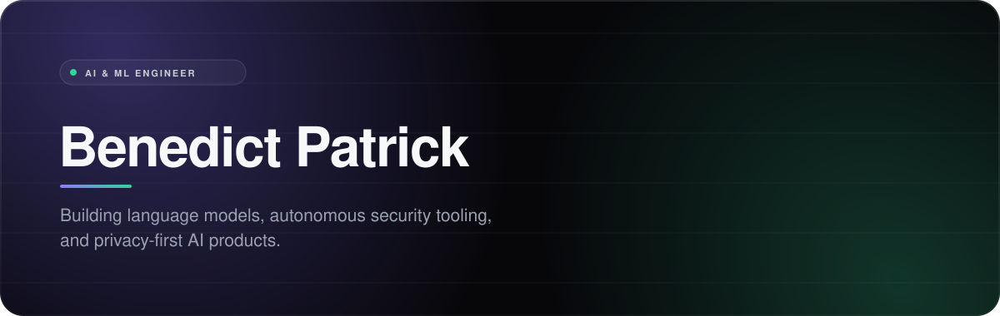

<div align="center">
  
</div>

<br/>

<div align="center">
  <a href="https://www.linkedin.com/in/benedictpatrickcodes/"></a>&nbsp;
  <a href="mailto:benedictroger2006@gmail.com"></a>
</div>

<br/>

<p align="center">
I work at the intersection of model architecture and applied AI systems — training language models from scratch, and shipping the tooling and products that put them to use. Currently split between LLM pretraining research and two products in active development.
</p>

<br/>

<div align="center">
   Benedict Patrick" />
</div>


## Building


**[Phobos](https://github.com/Benedictpatrick/Phobos-)** — a hybrid language model architecture: Mamba-2 selective state-space layers interleaved with sliding-window attention. Linear-time, linear-memory sequence modeling, with attention restored only where exact recall matters. The same codebase trains the hybrid model and a parameter-matched Transformer baseline, so any gain is measured, not assumed.

`PyTorch` `Mamba-2` `Muon optimizer`

<br/>


**[Navo AI](https://navoai.space)** — a private, offline AI assistant that runs entirely on-device. Browser-based, no data leaves the machine after the initial model download, with a choice of 20+ local models for chat, code, and math.

`Local inference` `WebGPU` `On-device LLMs`

<br/>


**SecureVibe** — an autonomous security engineer that scans codebases for vulnerabilities and opens pull requests with the fix already written.

```
npm install -g securevibe
```

`Python` `FastAPI` `AST-SAST` `LLMs`


<div align="center">
<sub>Benedict Patrick</sub>
</div>
