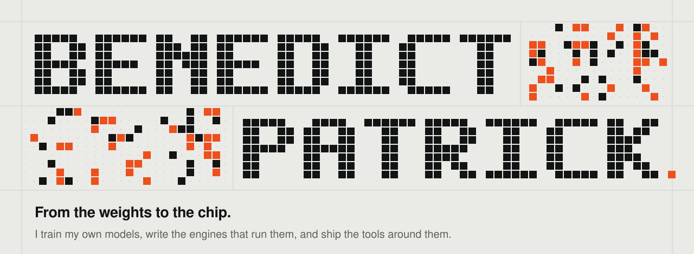
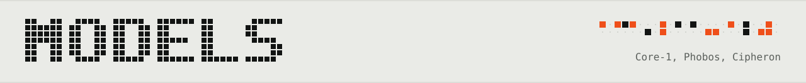
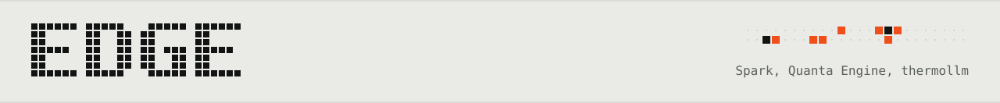
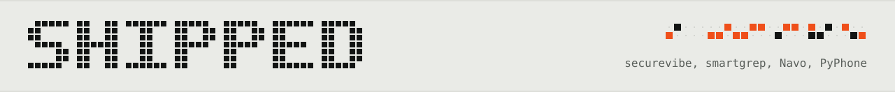
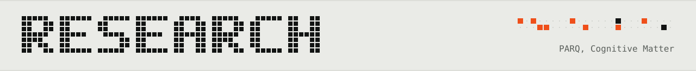
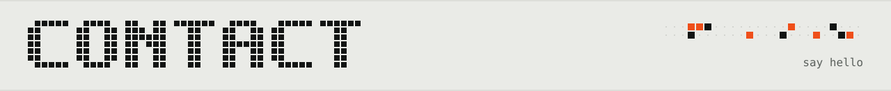
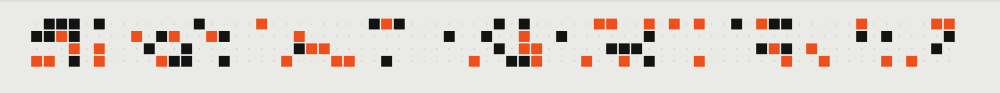

<picture>
  <source media="(prefers-color-scheme: dark)" srcset="assets/header-dark.svg">
  
</picture>

  <a href="https://github.com/Benedictpatrick/portfolio"><b>Portfolio</b></a>&nbsp;&nbsp;&nbsp;
  <a href="https://www.linkedin.com/in/benedictpatrickcodes/"><b>LinkedIn</b></a>&nbsp;&nbsp;&nbsp;
  <a href="mailto:benedictpatrickjohn@gmail.com"><b>Email</b></a>&nbsp;&nbsp;&nbsp;
  <a href="https://huggingface.co/bencodez"><b>Hugging Face</b></a>&nbsp;&nbsp;&nbsp;
  <a href="https://www.npmjs.com/~bencodess"><b>npm</b></a>

AI engineer working across the whole stack: architectures, training, inference engines and the products on top.

 

<picture>
  <source media="(prefers-color-scheme: dark)" srcset="assets/models-dark.svg">
  
</picture>

  <picture><source media="(prefers-color-scheme: dark)" srcset="assets/cards/core1-dark.svg"></picture>
  <picture><source media="(prefers-color-scheme: dark)" srcset="assets/cards/phobos-dark.svg"></picture>

  <a href="https://huggingface.co/bencodez/Cipheron"><picture><source media="(prefers-color-scheme: dark)" srcset="assets/cards/cipheron-dark.svg"></picture></a>

<picture>
  <source media="(prefers-color-scheme: dark)" srcset="assets/edge-dark.svg">
  
</picture>

  <picture><source media="(prefers-color-scheme: dark)" srcset="assets/cards/spark-dark.svg"></picture>
  <picture><source media="(prefers-color-scheme: dark)" srcset="assets/cards/quanta-dark.svg"></picture>

  <picture><source media="(prefers-color-scheme: dark)" srcset="assets/cards/thermollm-dark.svg"></picture>

<picture>
  <source media="(prefers-color-scheme: dark)" srcset="assets/shipped-dark.svg">
  
</picture>

  <a href="https://www.npmjs.com/package/securevibe"><picture><source media="(prefers-color-scheme: dark)" srcset="assets/cards/securevibe-dark.svg"></picture></a>
  <a href="https://benedictpatrick.github.io/smartgrep-web/"><picture><source media="(prefers-color-scheme: dark)" srcset="assets/cards/smartgrep-dark.svg"></picture></a>

  <a href="https://navoai.space"><picture><source media="(prefers-color-scheme: dark)" srcset="assets/cards/navo-dark.svg"></picture></a>
  <a href="https://pyphone-studio.vercel.app"><picture><source media="(prefers-color-scheme: dark)" srcset="assets/cards/pyphone-dark.svg"></picture></a>

<picture>
  <source media="(prefers-color-scheme: dark)" srcset="assets/research-dark.svg">
  
</picture>

  <a href="https://github.com/Benedictpatrick/Parkinson-detection-"><picture><source media="(prefers-color-scheme: dark)" srcset="assets/cards/parq-dark.svg"></picture></a>
  <picture><source media="(prefers-color-scheme: dark)" srcset="assets/cards/cognitive-dark.svg"></picture>

  <code>C++</code> <code>Python</code> <code>PyTorch</code> <code>TypeScript</code> <code>WebGPU</code> <code>ONNX</code> <code>ESP32</code> <code>Ollama</code> <code>tree-sitter</code> <code>FastAPI</code> <code>Next.js</code>

<picture>
  <source media="(prefers-color-scheme: dark)" srcset="assets/contact-dark.svg">
  
</picture>

Open to internships, research collaborations and hard problems in small places. The fastest way to reach me is **[benedictpatrickjohn@gmail.com](mailto:benedictpatrickjohn@gmail.com)**.

<picture>
  <source media="(prefers-color-scheme: dark)" srcset="assets/footer-dark.svg">
  
</picture>
